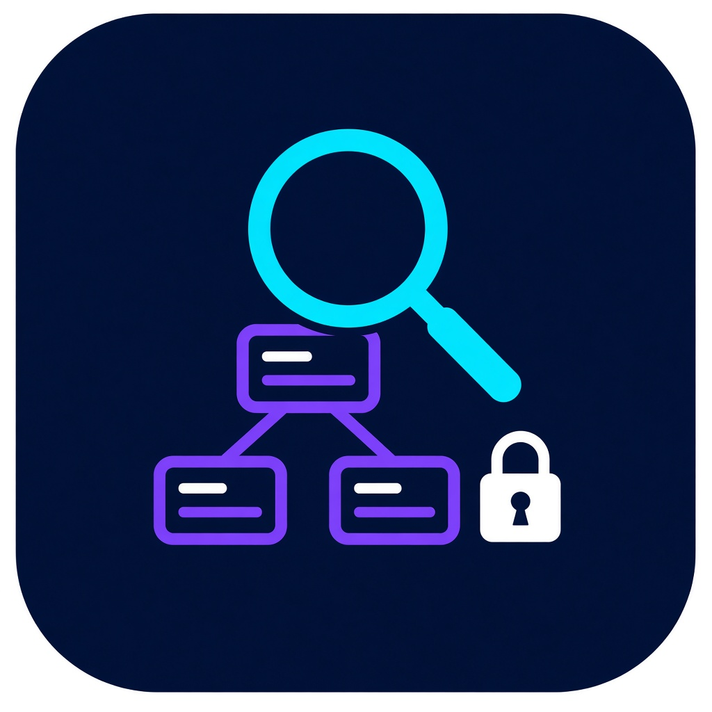

# Qodo Scout



[](https://github.com/qodo-ai/qodo-support-bundle/releases/tag/v0.3.1)


Qodo Scout is a portable CLI that collects bounded, redacted Kubernetes
diagnostics into a local archive. It reads cluster data through the operator's
existing `kubectl` access and never uploads the resulting bundle automatically.

## Install

The version-pinned installers download the immutable 0.3.1 release and verify
the selected binary with SHA-256 before installing the `qodo-scout` command.
They do not start a collection.

### macOS and Linux

```bash
rm -f ./install-qodo-scout.sh
curl -fL --proto '=https' --proto-redir '=https' --tlsv1.2 \
  -o ./install-qodo-scout.sh \
  https://get.qodo.ai/support-bundle/releases/0.3.1/install.sh &&
  sh ./install-qodo-scout.sh --version 0.3.1 --add-to-path
```

Use the installed command immediately in the same shell:

```bash
"${XDG_BIN_HOME:-$HOME/.local/bin}/qodo-scout" collect --interactive
```

Or open a new terminal and run:

```bash
qodo-scout collect --interactive
```

### Windows

Run this in **Command Prompt (cmd.exe)**:

```bat
curl.exe -fSLo "%TEMP%\install-qodo-scout.ps1" "https://get.qodo.ai/support-bundle/releases/0.3.1/install.ps1" && powershell.exe -NoProfile -File "%TEMP%\install-qodo-scout.ps1" -Version 0.3.1 -AddToPath
```

Use the installed command immediately in the same Command Prompt session:

```bat
"%LOCALAPPDATA%\Qodo\bin\qodo-scout.exe" collect --interactive
```

Or open a new Command Prompt session and run:

```bat
qodo-scout collect --interactive
```

For air-gapped installation, proxy behavior, provenance, and uninstall steps,
see the [installer guide](docs/installers.md).

## Prerequisites and scope

- `kubectl` on `PATH`, configured with the intended kubeconfig and context.
- Read access to pods, pod logs, events, and supported namespace-scoped
  workload resources.
- Cluster-scoped namespace listing only for automatic discovery or
  `--all-namespaces`.
- `pods/portforward` or `pods/exec` permission only for the optional telemetry
  or connectivity checks that the operator selects.
- A writable local filesystem for the owner-only output directory and archive.

Qodo Scout never requests Kubernetes Secrets or ConfigMaps. See the
[security model and RBAC reference](docs/security-model.md) for exact resource
access and optional-permission boundaries.

## Collect

Run the guided flow:

```bash
qodo-scout collect --interactive
```

The archive is saved under `~/qodo-support-bundles/`; nothing uploads automatically. See the [collection guide](docs/collection.md) for flags, optional sources, output, and exit behavior.

## Safety

Qodo Scout is read-only: it does not create or mutate Kubernetes resources.
Collection is bounded, sensitive text is redacted, and raw manifests,
environment values, command arguments, annotations, endpoint addresses, and
volume contents are omitted. Review every local archive before sharing it
through an approved support channel.

## Documentation

- [Collection guide](docs/collection.md) — automation flags, optional sources,
  archive behavior, and integrity checks.
- [Installer guide](docs/installers.md) — supported platforms, offline setup,
  verification, proxies, troubleshooting, and uninstall.
- [Security model](docs/security-model.md) — trust boundaries, Kubernetes RBAC,
  data handling, and platform assurance.
- [Publication runbook](docs/publication.md) — maintainer-only release
  publication and promotion.
- [Public distribution readiness](docs/public-readiness.md) — governance and
  pilot approval checklist.
- [Contributing](CONTRIBUTING.md) and [security reporting](SECURITY.md).
